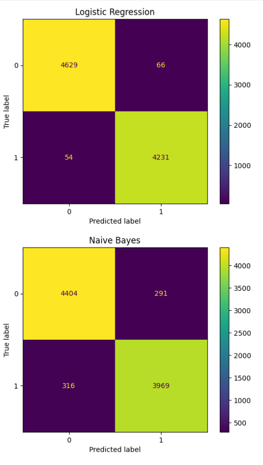
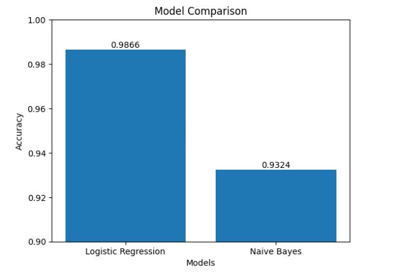

# Fake News Detection with Feature-Based Interpretability 📰

A machine learning approach to classify news articles as real or fake using NLP techniques, with emphasis on model behavior analysis and feature-level interpretability.

---

## 🚀 Overview

This project builds an end-to-end NLP pipeline to classify news articles and analyze how classical models make decisions.

Key focus:
- Text-based classification using TF-IDF
- Comparison of multiple models
- Interpreting predictions through feature importance

---

## 📊 Dataset

- ~44,000 news articles (Real + Fake)
- Balanced class distribution
- Includes structured sources (e.g., Reuters)

---

## ⚙️ Methodology

1. Data preprocessing (cleaning, normalization)
2. TF-IDF vectorization (max_features = 5000)
3. Train-test split (80/20)
4. Model training:
   - Logistic Regression
   - Multinomial Naive Bayes (baseline)
5. Evaluation:
   - Accuracy
   - Precision, Recall, F1-score
   - Confusion Matrix

---

## 📈 Model Comparison

| Model                  | Accuracy |
|-----------------------|---------|
| Logistic Regression   | ~98.7%  |
| Naive Bayes           | ~96–97% |

👉 Logistic Regression performs better due to its ability to handle feature weighting more effectively.

---

## 📊 Visualization

### Confusion Matrix (Logistic Regression)


### Model Comparison


---

## 🔍 Interpretability

Feature-level analysis was used to understand model behavior:

- Real news is associated with:
  - “reuters”, “said”, “washington”
- Fake news shows:
  - Informal and exaggerated language patterns

👉 The model relies heavily on stylistic and structural cues, not factual correctness.

---

## ⚠️ Limitations

- Does not verify factual truth
- Sensitive to dataset-specific patterns (e.g., Reuters bias)
- Weak on short or context-limited inputs
- Learns writing style more than semantic truth

---

## 💡 Key Insight

The model achieves high accuracy (~98%), but this is largely driven by learning source-specific and stylistic patterns, not actual fact verification.

This highlights an important limitation of classical NLP approaches in misinformation detection.

---

## 🛠 Tech Stack

- Python
- Pandas, NumPy
- Scikit-learn
- TF-IDF (NLP)

---

## 📂 Project Structure
```
fake-news-detection-with-explainability/
│
├── images/
│   └── confusion_matrix.png
│   └── model_comparison.png
│
├── notebook/
│   └── fake_news_detection.ipynb
│
├── .gitignore
│
├── Fake.csv
├── True.csv
│
├── requirements.txt
└── README.md
```

## ▶️ How to Run

1. Clone the repository
2. Install dependencies:
```
   pip install -r requirements.txt
```
3. Open the notebook:
   notebook/fake_news_detection.ipynb
4. Run all cells

## 📌 Future Work

- Explore additional baseline models (e.g., SVM, Random Forest) for broader comparison  
- Improve robustness on short and context-limited news samples  
- Reduce dataset-specific bias (e.g., source-related patterns like Reuters)  
- Incorporate contextual embeddings to better capture semantic meaning  
- Evaluate model performance on more diverse and real-world datasets
